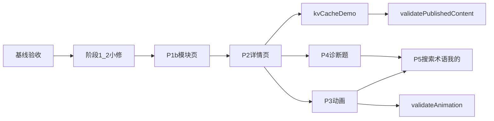

# 接手开发计划

## 当前判断

我已只读核对 [docs/dev-plan/dev-plan.md](docs/dev-plan/dev-plan.md)、[docs/product-spec.md](docs/product-spec.md)、[docs/architecture.md](docs/architecture.md)、[docs/content-schema.md](docs/content-schema.md)、[docs/animation-spec.md](docs/animation-spec.md)、[docs/acceptance-checklist.md](docs/acceptance-checklist.md)、[docs/project-board.md](docs/project-board.md) 与 [design.md](design.md)，并抽读了当前 `src`、`package.json`、`scripts/validate-content.ts`。

结论：阶段 1 的工程骨架、56 讲 stub、`validate:structure`，以及阶段 2 的路由、布局、进度 store 和首页主体已经落地；下一步应接 [docs/project-board.md](docs/project-board.md) 的当前里程碑：P1b 模块页 + P2 知识点详情页。

需要先承认的基线风险：

- [src/styles/tokens.css](src/styles/tokens.css) 已定义设计变量，但 [src/styles/global.css](src/styles/global.css) 没有导入它；当前 `main.tsx` 只 import `global.css`，视觉 token 可能未生效。
- 阶段 3 组件目录尚未创建：`src/components/concept/`、`src/components/animation/`、`src/components/quiz/`、`src/components/search/`。
- `ModulesPage`、`ModulePage`、`ConceptPage`、`SearchPage`、`GlossaryPage`、`ProfilePage` 仍是占位页，符合阶段 2 预期，但主链路尚未闭环。
- `validate:published-content` 与 `validate:animation` 目前是阶段占位，等 demo/mvp 内容与动画 registry 落地后再补强。

## 接手原则

- 以 [docs/content-schema.md](docs/content-schema.md) 为数据权威：56 讲、`10/10/8/16/6/6`、字段名和 `contentStatus` 不擅自改。
- 内容、动画步骤、诊断题只进入 `src/data/*`；组件只渲染数据，不写死课程正文。
- 视觉按 [design.md](design.md)：暖纸色、蓝/绿强调、首页不 dashboard 化、详情页保持长阅读节奏。
- 每个阶段结束都跑门禁：`npm run validate:structure`、`npm run typecheck`、`npm run lint`、`npm run build`；有 demo/mvp 内容后再把 `validate:published-content` 做实。

## 执行顺序

1. 接手基线验收

   先跑 `npm install`、`npm run validate:structure`、`npm run validate:content`、`npm run typecheck`、`npm run lint`、`npm run build`，再用 `npm run dev` 手动核对首页、Sidebar 模块计数、路由跳转和 LocalStorage 容错。这个步骤只确认阶段 1/2 是否真绿，不改业务范围。

2. 修补阶段 1/2 小缺口

   优先修复 `tokens.css` 未进入构建链；补齐权威目录中下一阶段必须用到的组件目录；确认 `content/reviewed/` 是否需要建立为空目录；检查 `/favicon.svg` 引用是否造成浏览器 404。这里保持小修，不改数据 schema。

3. 推进 P1b：模块总览与模块详情

   实现 `ModulesPage`、`ModulePage` 和 `ConceptCard`。模块详情页展示该模块知识点列表，支持难度、完成状态、收藏状态、有无动画筛选，以及推荐/时长/难度排序。卡片字段严格来自 `src/data/concepts.ts` 和 `progressStore`。

4. 推进 P2：知识点详情页

   实现 `ConceptPage` 和 `ConceptHeader`、`ConceptSection`、`TakeawayBox`、`RelatedConcepts`。详情页按产品规格的 12 段顺序渲染，stub 内容要优雅降级；进入详情页调用 `recordVisit`，完成/收藏按钮接 `progressStore`，下一个知识点按模块顺序计算。

5. 建立第一个 demo 闭环

   将 `kv-cache` 从 stub 提升为 demo，内容先使用 [docs/content-schema.md](docs/content-schema.md) §5 的完整样例，但动画段在 P3 前保持占位或不启用 `hasAnimation`。同时开始补实 `validate:published-content`，只校验 `contentStatus` 为 `demo`/`mvp` 的知识点。

6. P3/P4 并行准备

   P2 稳定后再做 `AnimationPlayer` + registry + fallback + `KVCacheAnimation`，并启用 `validate:animation`；同时做 `DiagnosticQuestion`、选项、解析、错题记录，先接 `kv-cache` 样题。

7. P5 收尾主功能

   实现本地搜索、术语页、我的学习页。搜索范围按 `title / definition / tags / mechanism / enterpriseCase / pitfalls`，Profile 展示总进度、模块进度、最近学习、收藏、错题和清空记录。

## 依赖关系

## 暂不做

- 不批量合入 56 讲正文。
- 不在 P2 前做动画真实实现。
- 不引入重型 UI 框架或真实 AI API。
- 不做 Service Worker、离线缓存、登录、后端或内容后台。
- 不重构阶段 1/2 已工作的代码，除非门禁或验收暴露问题。