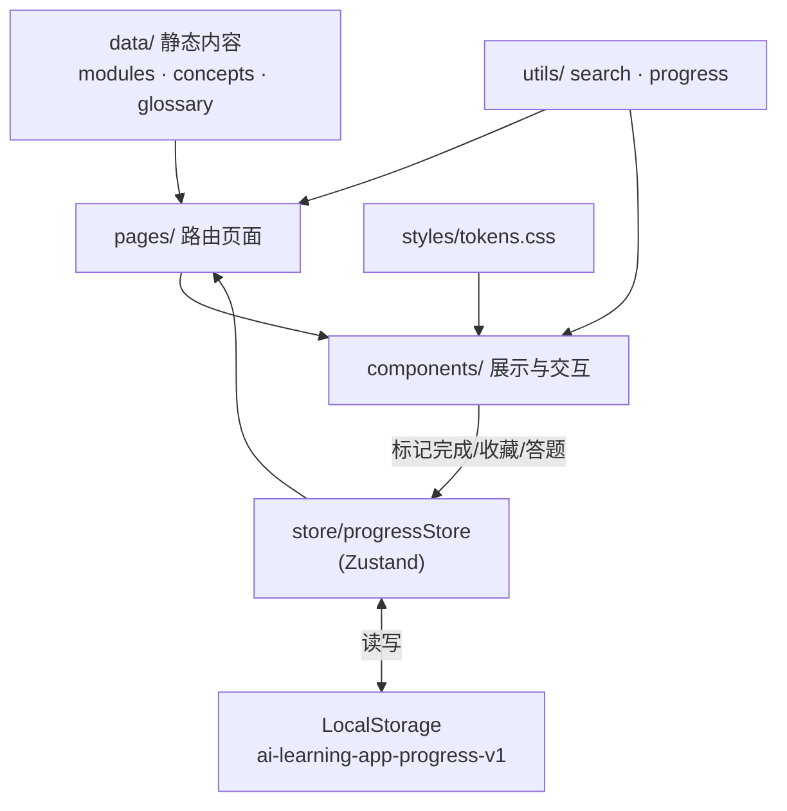
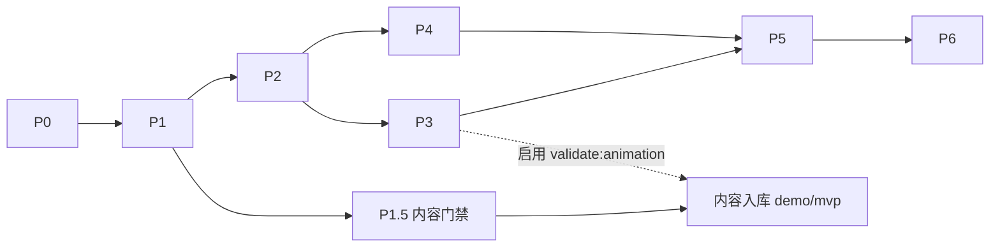

# 技术架构 · architecture

> 纯前端、内容数据驱动的 Web/PWA。技术栈与目录见 [AGENTS.md](../AGENTS.md)。数据 schema 见 [content-schema.md](content-schema.md)。

## 1. 分层架构

四层单向依赖，上层依赖下层，禁止反向依赖：

```text
样式层 styles/        ← tokens.css / global.css（仅被组件消费）
  ↑
页面与组件层 pages,components/
  ↑
状态层 store/         ← Zustand progressStore（唯一全局状态）
  ↑
数据层 data/          ← modules.ts / concepts.ts / glossary.ts（静态内容）
```

- 数据层：纯静态内容，符合 `src/types/index.ts` 的类型，无副作用。
- 状态层：只管“用户进度类”可变状态（完成、收藏、错题、最近访问、连续天数），并负责 LocalStorage 持久化。
- 页面/组件层：从数据层读内容、从状态层读/写进度，纯展示与交互。
- 样式层：设计变量集中，组件通过 CSS 变量/Module 消费。

### 数据流图



## 2. 组件清单与职责

| 分组 | 组件 | 职责 |
|---|---|---|
| layout | `AppShell` | 整体布局：桌面左侧栏 + 顶部条 + 主区；移动端底部导航 |
| layout | `Header` | breadcrumb、搜索入口、连续学习天数 |
| layout | `Sidebar` | 产品名、一级导航、六大模块列表、底部总进度 |
| layout | `BottomNav` | 移动端底部导航 |
| concept | `ConceptCard` | 模块页知识点卡片（标题/定义/难度/时长/动画/完成/收藏） |
| concept | `ConceptHeader` | 详情页标题区与元信息 |
| concept | `ConceptSection` | 详情页通用章节容器（为什么重要/机制/案例/误区/结论） |
| concept | `TakeawayBox` | 核心结论高亮块 |
| concept | `RelatedConcepts` | 关联知识点跳转 |
| animation | `AnimationPlayer` + 各动画 | 统一播放器与机制动画，见 [animation-spec.md](animation-spec.md) |
| quiz | `DiagnosticQuestion` / `OptionCard` / `ExplanationPanel` | 诊断题渲染、选项、解析与排查路径 |
| progress | `ProgressBar` / `ModuleProgress` / `StudyStats` | 进度条、模块进度、学习统计 |
| search | `SearchBox` + `SearchPage` 内联结果 | 搜索输入与结果列表 |

## 3. 状态管理与持久化

`store/progressStore.ts`（Zustand）管理 `UserProgress`：

```ts
interface UserProgress {
  completedConceptIds: string[];
  favoriteConceptIds: string[];
  wrongQuestionIds: string[];
  lastVisitedConceptId?: string;
  lastStudyDate?: string;
  studyStreakDays: number;
}
```

- 动作：标记/取消完成、收藏/取消收藏、记录错题、记录最近访问、计算模块完成度、清空记录。
- 持久化：key 固定 `ai-learning-app-progress-v1`，写入结构带 `version` 字段：`{ version: 1, progress }`。
- 要求：页面刷新进度不丢失；解析失败时回退到默认空进度（容错）；提供清空学习记录。
- 派生值（完成度百分比、模块 done/total、连续天数展示）在 selector/工具中计算，不冗余存储。

### 3.1 持久化版本与迁移策略

字段演进时不得丢用户进度，迁移逻辑集中在 `utils/progress.ts`：

```ts
export const CURRENT_PROGRESS_VERSION = 1;

// 读取入口：解析 → 校验 version → 迁移 → 兜底
function loadProgress(): UserProgress {
  const raw = localStorage.getItem('ai-learning-app-progress-v1');
  if (!raw) return defaultProgress();
  try {
    const parsed = JSON.parse(raw) as { version: number; progress: unknown };
    return migrateProgress(parsed.version, parsed.progress);
  } catch {
    return defaultProgress();           // 解析失败：兜底为空进度
  }
}

// 按 version 逐级迁移；无法识别的版本兜底为默认值（不抛错、不清空 localStorage 原始备份）
function migrateProgress(fromVersion: number, data: unknown): UserProgress { /* v0→v1→… */ }
```

规则：
- `CURRENT_PROGRESS_VERSION` 是唯一版本号常量，写入时一并落 `version`。
- 每次破坏性字段变更必须 `+1` 版本并补一条迁移分支；迁移须保留可迁移字段。
- 无法迁移（版本高于当前 / 数据结构异常）时回退到 `defaultProgress()`，并保证 UI 不崩溃；用户感知为“进度重置”而非白屏。
- 迁移成功后用新结构回写，旧数据自然覆盖。

## 4. 本地搜索

`utils/search.ts` 在前端对 `concepts` 做本地检索。

- 搜索字段：title、definition、tags、mechanism、enterpriseCase、pitfalls。
- 排序规则：标题完全匹配 > 标题包含关键词 > 标签匹配 > 正文匹配。
- 结果类型：知识点（首版）；术语、诊断题为后续扩展项。
- 实时搜索、空查询提示、空结果提示；结果上限（如 12 条）避免长列表。

## 5. 响应式策略

- 桌面端：固定左侧栏约 256px + 顶部工具条（约 56px，半透明 + blur）+ 主阅读画布。首页主区最大宽约 1120px，详情页正文 760–860px，左右留白约 40px。
- 移动端（后续适配，保留同样阅读节奏）：左侧导航收为抽屉或底部导航；主内容单列；首页只保留继续学习、进度、推荐路径核心入口；详情页优先阅读舒适，不堆侧边信息；无横向滚动。

## 6. 可拆分开发阶段

对齐 PRD 里程碑，拆为 7 个阶段，每阶段结束项目必须可运行。依赖为线性顺序（P0→P6），P3 与 P4 可在 P2 完成后并行。

| 阶段 | 名称 | 产出 | 验收 |
|---|---|---|---|
| P0 | 项目初始化 | Vite+React+TS 骨架、路由、全局样式、目录结构、mock 数据 | `npm install` / `npm run dev` 成功，首页可访问，路由可跳转 |
| P1 | 首页 + 模块页 | 首页、模块卡片、模块详情页、知识点卡片、接入基础数据 | 看到 6 模块、能进模块页、看到知识点列表、卡片状态正确 |
| P1.5 | 内容/数据门禁 | `scripts/validate-content.ts` + `validate:structure`（见 §7.1） | `validate:structure` 对 56 登记全绿；只阻塞内容入库，不阻塞页面开发 |
| P2 | 知识点详情页 | 详情页渲染定义/机制/案例/误区/结论、关联知识点、完成/收藏按钮 | 任意知识点可打开、结构完整、完成与收藏状态可保存 |
| P3 | 动画组件 | AnimationPlayer + 首版动画组件（见 animation-spec） | 可播放/暂停/切步/重置，步骤说明同步，移动端可用 |
| P4 | 诊断题 | DiagnosticQuestion 单选/多选、提交、解析、错题记录 | 答题流程顺畅、判定准确、解析清晰、错题可记录 |
| P5 | 搜索/术语/我的学习 | 本地搜索、术语索引、Profile 进度统计、最近学习、清空记录 | 搜索可用、术语可浏览、进度与最近学习准确、清空可用 |
| P6 | 打磨与发布 | 响应式适配、视觉统一、内容补齐、构建检查、README、部署配置 | 桌面/移动端体验稳定、构建成功、可静态部署 |

### 阶段依赖图

P1.5 是**内容入库门禁**，挂在内容生产链路上，**不阻塞页面开发**（P2 仍只依赖 P1）。即：页面/组件可照常推进；只有内容进入 `src/data/*` 必须先过 P1.5 的 `validate:structure`（动画相关校验到 P3 才启用）。



## 7. 工程约束

- 数据与组件分离；动画步骤、诊断题配置化；状态集中。
- TypeScript 无类型错误；ESLint 无严重错误；构建成功；路由刷新不报错。
- 不引入重型 UI 框架与未使用的大型依赖。

### 7.1 可执行内容门禁（分级 `validate:*`）

仅靠人工无法阻止数据漂移，骨架阶段（P1.5）即落地 `scripts/validate-content.ts`。为避免在动画/内容实现前被卡住，门禁拆为三个子命令，按阶段启用（规则与启用阶段以 [content-schema.md](content-schema.md) §6 为权威）：

- `validate:structure`（P1.5 起，始终）：56 登记与模块计数、id/slug 唯一、moduleId/order 合法、关联无悬空、`contentStatus` 合法、诊断题结构。**不碰动画、不要求 stub 正文**。
- `validate:published-content`（出现 demo/mvp 内容后）：仅对 `contentStatus ∈ {demo,mvp}` 校验字段完整度。
- `validate:animation`（P3 动画 registry 落地后）：`hasAnimation` 与 `animation` 一致、`type` 已注册、步骤合法。

`npm run validate:content` 为聚合命令，按当前阶段组合上述子命令。脚本只读 `src/data/*` 与 `src/types/*`，失败即非零退出，纳入 CI 与发布门禁。
